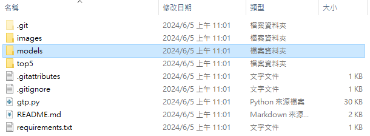
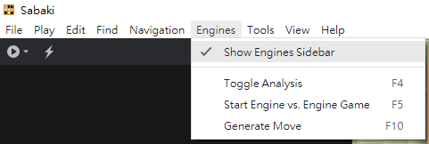
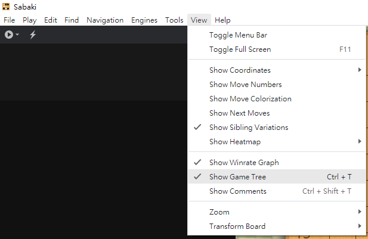
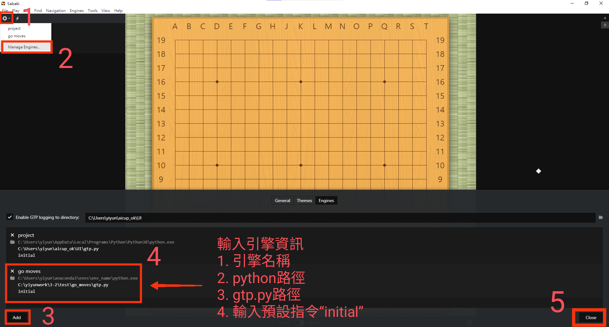
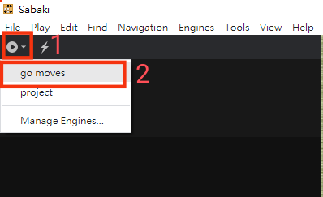
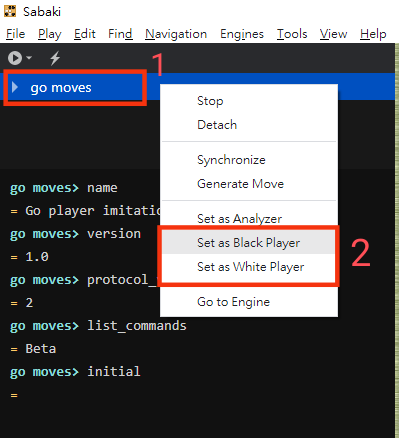

# 使用方法
## 環境
CUDA 11.8<br>
cuDNN 8.9.7

## 下載程式碼及安裝環境
輸入以下指令來下載程式碼
```cpp=
git clone https://github.com/Kaikai0522/go_moves.git
```

使用anaconda prompt，輸入以下指令來安裝虛擬環境，env_name改為自訂環境名稱
```cpp=
conda create --name {env_name} python=3.9
conda activte {env_name}
cd go_moves
pip install -r requirements.txt
```
或是直接安裝套件，不構建虛擬環境
```cpp=
pip install -r requirements.txt
```

到以下網址下載模型：https://drive.google.com/file/d/1mcl2pfXWZuq5kCN0BmI0HfPFNcmveBdP/view?usp=sharing
<br>
並新建一個資料夾取名為models，將下載的模型放到資料夾中。


## 下載Sabaki
https://sabaki.yichuanshen.de/

## 設定Sabaki

### 1. 打開左側Engines Sidebar
Engines → Show Engines Sidebar<br>


### 2. 打開右側Game Tree
View → Show Game Tree<br>


### 3. 設定圍棋引擎
點擊Attach Engine按鈕(播放按鈕) → Manages Engines → Add → 設置引擎 → Close (Close後會自動儲存)

**如使用虛擬環境安裝套件，則python路徑為虛擬環境python路徑 ex: "C:\Users\88697\anaconda3\envs\\{env_name}\python.exe"**


### 4. 選擇圍棋引擎
點擊Attach Engine按鈕(播放按鈕) → 選擇go moves引擎<br>


### 5. 設定對手棋子顏色
對引擎名稱點擊右鍵 → 選擇Set as Black/White Player<br>

<br>(要讓模型下黑棋，第一手需對引擎右鍵 → Generate Move，強制模型下第一手)
做完以上設定就可以開始跟圍棋引擎對弈

備註：模型一開始會直接預設對手是黑棋，直接建議第一手位置。如果開啟圍棋引擎時，盤面上已有棋子，需要模型推薦著手的話，要對引擎右鍵 → Synchronize，讓引擎與Sabaki同步，才能推薦下一個著手的位置。

### 6. 儲存棋譜
點擊右下角視窗的Save File按鈕(如下圖)，即可在sgf資料夾中看到存好的棋譜(棋譜命名為目前時間)。<br>


